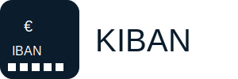

# **K**Iban—Kotlin Multiplatform IBAN Library


## Introduction

This Kotlin Multiplatform library is a continuation and re-implementation of the original [`java-iban`](https://github.com/barend/java-iban) library by Barend Garvelink. It delivers IBAN validation, formatting, and country-specific IBAN details. The library is aimed to fulfill the same features as the original but in a Kotlin Multiplatform environment.

> ⚠ **Important Note**: The API of this library is still evolving and not yet stable. Expect breaking changes until the API stabilizes in a future release.

### Background

The original [`java-iban`]((https://github.com/barend/java-iban)) library laid a solid foundation for IBAN validation and utility functions in Java environments. This library reimagines those capabilities with Kotlin's cross-platform features, making it ready for use on multiple platforms such as JVM, Android, iOS, and more.

## Features

- Validate International Bank Account Numbers (IBANs).
- Retrieve country-specific IBAN details.
- Multiplatform compatibility across Kotlin-supported targets.

## Use

Obtain an `Iban` instance using one of the static factory methods: `valueOf( )` and `parse( )`. Methods throw `IllegalArgumentException` on invalid input.

``` kotlin
    // Obtain an instance of Iban.
    val iban = Iban.valueOf( "NL91ABNA0417164300" )

    // toString() emits standard formatting, toPlainString() is compact.
    val formatted = iban.toString() // "NL91 ABNA 0417 1643 00"
    val plain = iban.toPlainString() // "NL91ABNA0417164300"

    // Input may be formatted.
    val anotherIban = Iban.valueOf( "BE68 5390 0754 7034" )
    
    // IBAN implements Comparable<T>.
    val ibans = getListOfIBANs()
    ibans.sorted() // sorts in lexical order
    
    // The equals() and hashCode() methods are implemented.
    val ibansAsKeys = mutableMapOf<Iban, String>()
    ibansAsKeys.put( iban, "this is fine" )
    
    // You can use the Modulo97 class directly to compute or verify the check digits on an input.
    val candidate = "GB29 NWBK 6016 1331 9268 19"
    val valid = Modulo97.verifyCheckDigits( candidate ) // true
    
    // Compose the IBAN for a country and BBAN
    Iban.compose( "BI", "201011067444" ) // BI43201011067444

    // You can query whether an IBAN is of a SEPA-participating country
    val isSepa = Iban.parse(candidate).isSEPA // true

    // You can query whether an IBAN is in the SWIFT Registry
    val isRegistered = Iban.parse(candidate).isInSwiftRegistry // true

    // Modulo97 API methods take CharSequence, not just String.
    val builder = StringBuilder( "LU000019400644750000" )
    val checkDigits = Modulo97.calculateCheckDigits( builder ) // 28

    // Modulo97 API can calculate check digits, also for non-iban inputs.
    // It does assume/require that the check digits are on indices 2 and 3.
    Modulo97.calculateCheckDigits( "GB", "NWBK60161331926819" ) // 29
    Modulo97.calculateCheckDigits( "XX", "X" ) // 50

    // Get the expected IBAN length for a country code:
    val expectedLength = CountryCodes.getLengthForCountryCode( "DK" )

    // Get the Bank Identifier and Branch Identifier:
    val bankId: String? = CountryCodes.getBankIdentifier( iban )
    val branchId: String? = CountryCodes.getBranchIdentifier( iban )

    // Get the Bank Identifier and Branch Identifier as Java Optional:
    val bankId = IbanFields.getBankIdentifier( iban ) // Optional<String>
    val branchId = IbanFields.getBranchIdentifier( iban ) // Optional<String>
```

## Design choices

### Java IBAN library

I [(Barend)](https://github.com/barend) like the Joda-Time library, and I try to follow the same design principles. I'm explicitly targetting Android, which at the time this library started was still on Java 1.6. I'm trying to keep the library as simple as I can.
* Easy to integrate: don't bring transitive dependencies. **Note:** this is not true for KMP variant since Kotlin Time and Bignum dependencies added to keep orignal functionality.
* The `Iban` objects are immutable, and the Iban therein is non-empty and valid. There is no support for partial or invalid IBANs. Note that "valid" isn't as strict as it could be:
  * It checks that the length is correct (varies per country) and that the check digits are correct.
  * The national format mask (such as `QA2!n4!a21!c`) is not enforced. This seems to me like more work than necessary. The modulo-97 checksum catches most input errors anyway, and I don't want to force a memory-hungry regex check onto Android users. Speaking of Android, this mask could be used for keyboard switching on an Iban EditText, but that's for a different open-source project.
  * Any national check digits are not enforced. Doing this right is more work than I want to put into this. I lack the country-specific knowledge of all the gotchas and intricacies. If other countries' check digits are anything like those in the Netherlands, they're going to differ by Bank Identifier.
* There is no way to configure extra restrictions such as "only SEPA countries" on the `Iban.valueOf()` method. This, to me, would look too much like Joda-Time's pluggable `Chronology` system, which leads to PoLS violations (background: [Why JSR-310 isn't Joda-Time](https://blog.joda.org/2009/11/why-jsr-310-isn-joda-time_4941.html)).
* There is no class to represent a partially entered IBAN or a potentially-invalid IBAN. I'm sure there are use cases where you want to shift this sort of data around. As far as this library is concerned, if it's not an Iban it's just a string, and there already exist data types for dealing with those.
* Any feature that's not present in all IBAN's is kept outside the `Iban` class. Currently, that's the support for extracting Bank and Branch identifiers, which lives in the `CountryCode` class.
* The library originally supported an SDK 14 (Ice Cream Sandwich) era Android app. This is why it relies on bit-packing to reduce bytecode size.

### Kotlin library

Adopted design choices from Java library and going to do next:
* Kotlinize API so it is idiomatic to Kotlin user
* Deprecate old API and provide automatic migrate mechanism
* TBA

## References

* [SWIFT IBAN Registry](https://www.swift.com/sites/default/files/resources/iban_registry.pdf)
* [SEPA Participants](https://www.europeanpaymentscouncil.eu/document-library/other/epc-list-sepa-scheme-countries)
* [Experimental IBANs](https://www.iban.com/structure)
* [General Information](http://en.wikipedia.org/wiki/IBAN)

## Contributions & Stability

As this is still an evolving library with an unstable API, contributions are welcome! Join the development journey and help shape a modern, multiplatform IBAN utility library.

## License

This project follows the same licensing model as the original library and is licensed under the [Apache License 2.0](https://www.apache.org/licenses/LICENSE-2.0).